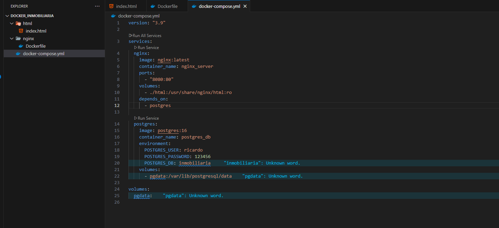
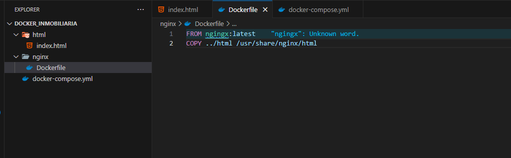
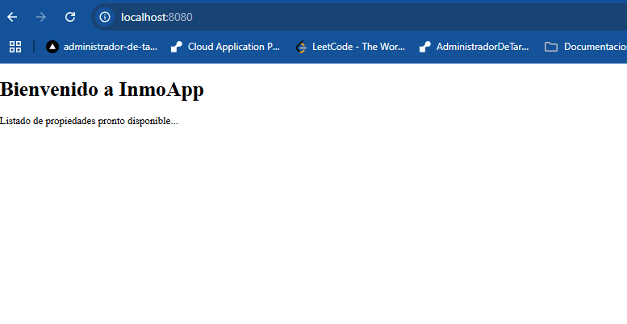
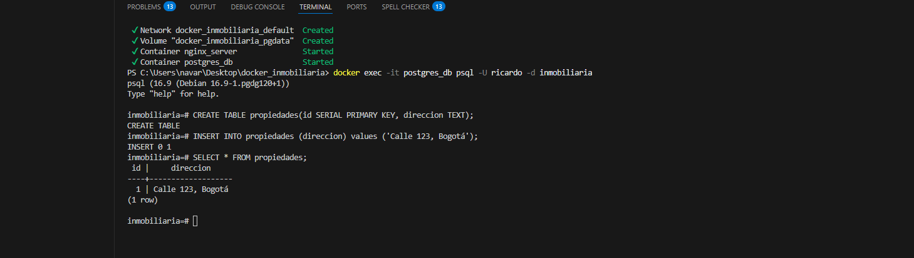

# 🐳 Proyecto Docker Inmobiliaria

Este proyecto muestra cómo levantar un entorno básico con **Docker** y **Docker Compose** que incluye:

- Un servidor web Nginx.
- Una base de datos PostgreSQL.
- Volúmenes para persistencia.
- Redes virtuales para comunicación segura entre contenedores.

### Grupo 7.

---

## 📘 Contenidos

1. [Imágenes vs Contenedores](#-1-cuál-es-la-diferencia-entre-una-imagen-y-un-contenedor)
2. [Beneficios de Docker Compose](#-2-qué-beneficios-aporta-docker-compose-frente-a-ejecutar-contenedores-por-separado)
3. [Mecanismos de Seguridad](#-3-qué-mecanismos-de-seguridad-podrías-aplicar-a-esta-arquitectura)
4. [Extensiones del Entorno](#-4-cómo-podrías-extender-este-entorno-para-simular-una-app-completa)
5. [Comunicación entre Contenedores](#-cómo-se-comunican-los-servidores-entre-sí)
6. [Archivos Relevantes](#-archivos-del-proyecto)

---

## 📌 1. ¿Cuál es la diferencia entre una imagen y un contenedor?

- Una **imagen** es como la plantilla o el molde de una aplicación: contiene todo lo necesario para ejecutarla (código, librerías, configuraciones). Es inmutable y estática.
- Un **contenedor** es una instancia en ejecución de esa imagen. Es como cuando usas una receta (imagen) para cocinar un plato (contenedor). Cada vez que corres la imagen, creas un contenedor activo, que puede cambiar su estado mientras corre.

---

## Arquitectura

- Frontend: Página web estática servida por Nginx
- Base de datos: PostgreSQL para persistencia de datos
- Orquestación: Docker Compose para gestión de servicios
  
---

## Instalación y uso

Prerrequisitos
- Docker
- Docker Compose

Acceso a la aplicación
- Aplicación web: http://localhost:8080
- Base de datos: Puerto 5432 (interno)

``` docker-compose up -d --build ```

---

## 🛠 2. ¿Qué beneficios aporta Docker Compose frente a ejecutar contenedores por separado?

Docker Compose facilita mucho la vida cuando tienes varios contenedores que necesitan trabajar juntos, por ejemplo:

- Una aplicación con su base de datos y su servidor web.
- Todo definido en un solo archivo (`docker-compose.yml`).
- Puedes levantar, detener y administrar todo el stack con un solo comando (`docker-compose up -d`).
- El entorno es reproducible y fácil de compartir con otros, ya que toda la configuración está centralizada.

---

## 🔒 3. ¿Qué mecanismos de seguridad podrías aplicar a esta arquitectura?

✅ **Variables de entorno seguras**  
No dejar contraseñas en texto plano ni en archivos públicos; usar gestores de secretos o variables fuera del código.

✅ **Limitar privilegios**  
Ejecutar los contenedores con usuarios no root para evitar riesgos.

✅ **Redes aisladas**  
Crear redes privadas para que los contenedores solo se comuniquen entre sí.

✅ **Firewalls y reglas de acceso**  
Exponer solo los puertos necesarios.

✅ **Actualizaciones y parches**  
Mantener las imágenes actualizadas para evitar vulnerabilidades.

✅ **Escaneo de imágenes**  
Usar herramientas que revisen las imágenes antes de desplegarlas en producción.

---

## 🚀 4. ¿Cómo podrías extender este entorno para simular una app completa?

Podrías agregar más servicios al `docker-compose.yml`:

- ✨ **Backend** (Node.js, Django, etc.) conectado a PostgreSQL.
- ✨ **Frontend** (React, Angular, Vue) servido con Nginx.
- ✨ **Sistema de cache** (Redis) para mejorar el rendimiento.
- ✨ **Colas de mensajes** (RabbitMQ) para tareas asíncronas.
- ✨ **Proxy inverso** (Traefik o Nginx) para manejar certificados SSL.

Además, se pueden agregar:

- Volúmenes para persistencia de datos.
- Redes aisladas para separar cada servicio.
- Variables de entorno para configuración dinámica.

Así se simula una aplicación real de principio a fin en un entorno reproducible.

---

## 🌐 ¿Cómo se comunican los servidores entre sí?

Los contenedores se comunican usando **redes virtuales** que Docker crea automáticamente:

- Cada contenedor tiene su propia dirección IP dentro de esa red.
- Usan protocolos estándar (TCP/IP) para enviarse datos.
- Por ejemplo, el backend puede conectarse a PostgreSQL usando el nombre del servicio definido en `docker-compose.yml` (por ejemplo, `postgres`) como si fuera una dirección.
- Esto permite que los servicios interactúen de forma segura y eficiente sin exponer puertos al exterior si no hace falta.

---

## 📂 Archivos del proyecto

- **`docker-compose.yml`**  
  Define todos los servicios, redes y volúmenes.

- **`Dockerfile` de Nginx**  
  Personaliza la imagen del servidor web (opcional si usas la imagen oficial directamente).

- **Frontend estático**  
  Archivos HTML/JS/CSS montados en el contenedor Nginx.

- **Scripts SQL (creación de tablas)**  
  Puedes incluir scripts para inicializar la base de datos.

---

> **💡 Nota:** Este proyecto fue creado como un entorno de pruebas, demostración y aprendizaje sobre Docker y Compose.

---

Imagenes




---
